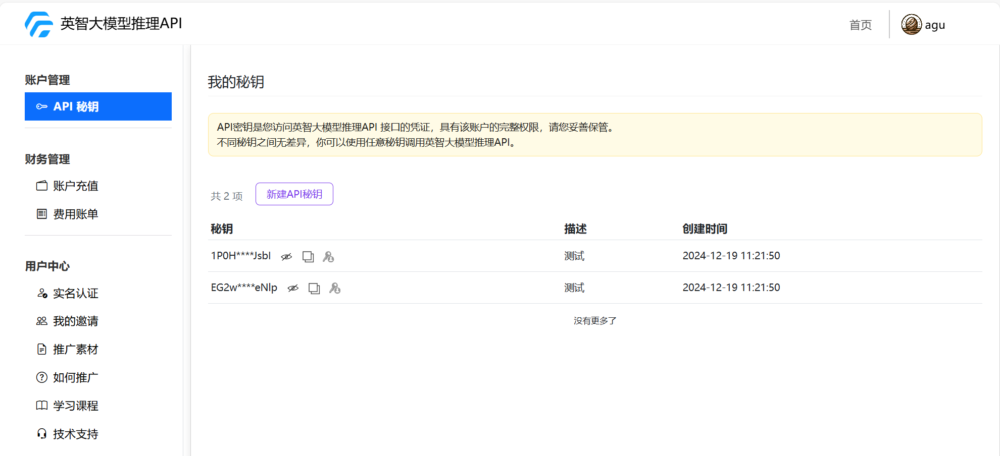
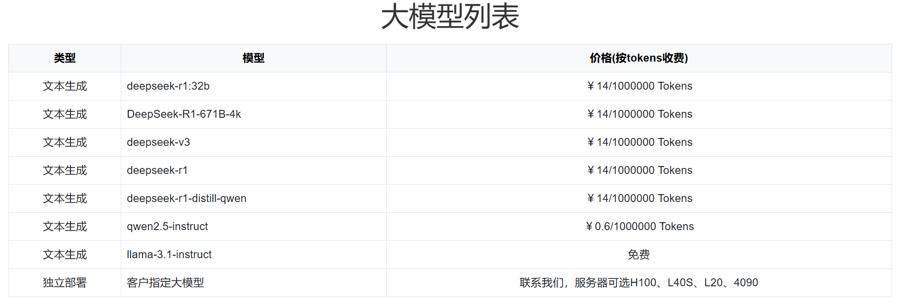

# 通用

## API 服务地址

https://apiemp.baystoneai.com/cognihub/service

## API-Key

登录官网在"我的控制台"获取

## 可用模型 

在官网首页可以查看所有可用模型

## 流式处理（Streaming）

流式处理是一种逐步返回数据的方式，适用于需要快速反馈和更流畅用户体验的场景。

### 特点
- 逐步返回响应：模型会在生成内容时实时返回数据，而不是等到整个回答完成后再一次性返回。
- 更快的用户体验：用户可以更快地看到部分响应，而无需等待完整结果。
- 适用于实时交互：特别适用于聊天机器人、实时翻译等应用场景。
- 减少超时风险：对于长文本输出，流式处理可以降低因超时导致的请求失败。

### 实现方式
在 API 请求中，使用 stream=true 参数即可启用流式处理 例如：

## 非流失处理

