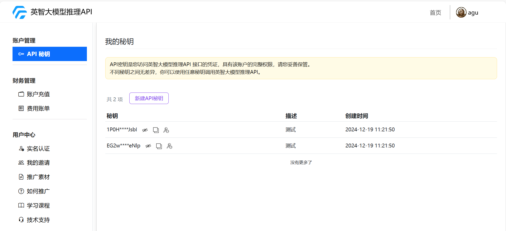

# 快速上手

### 1. 登录平台

访问 英智大模型推理API 官网: https://api.baystoneai.com/  并点击右上角“登录”按钮，按照提示填写您的基本信息进行登录。


### 2. 查看支持的模型列表

在官网的首页正中间的大模型列表,


## 大模型列表

| 类型   | 模型                          | 价格(按tokens收费)                |
|--------|-------------------------------|----------------------------------|
| 文本生成 | deepseek-r1:32b               | ¥14/1000000 Tokens             |
| 文本生成 | DeepSeek-R1-671B-4k           | ¥14/1000000 Tokens             |
| 文本生成 | deepseek-v3                   | ¥14/1000000 Tokens             |
| 文本生成 | deepseek-r1                   | ¥14/1000000 Tokens             |
| 文本生成 | deepseek-r1-distill-qwen      | ¥14/1000000 Tokens             |
| 文本生成 | qwen2.5-instruct              | ¥0.6/1000000 Tokens            |
| 文本生成 | llama-3.1-instruct            | 免费                           |
| 独立部署 | 客户指定大模型                 | 联系我们，服务器可选H100、L40S、L20、4090 |


### 3. 获取API Key

如果您是首次使用, 需要创建API-KEY, 点击右上角“个人头像”，打开"我的控制台"。在控制台的"API秘钥"中，点击“新建API秘钥”按钮，按照提示填写信息，即可创建API Key。

如果您已经有API-KEY, 可以在控制台的"API秘钥"中，点击“查看”按钮，即可查看,复制您的API Key。 在官网首页中也可以查看和复制API Key。



### 4. 英智大模型推理API调用方法

#### 4.1 使用curl命令调用

您可以直接在命令行中使用curl命令调用API，其中 YOUR_API_KEY 参数替换成自己的API-KEY, 以下是一个使用模型deepseek-r1-distill-qwen的示例： 

```sh
export API_BASE_URL="https://apiemp.baystoneai.com/cognihub/service"
export API_KEY="{YOUR_API_KEY}"

curl -X POST $API_BASE_URL/v1/chat/completions -H"Content-Type: application/json" -H "Authorization: Bearer $API_KEY" -d '{
    "model": "deepseek-r1-distill-qwen",
    "stream": true,
    "messages": [
        {"role": "system", "content": "You are ahelpful assistant."},
        {"role": "user", "content": "Who won the world series in 2020?"},
        {"role": "assistant", "content": "The LA Dodgers won in 2020."},
        {"role":"user", "content": "Where was it played?"}
    ]
}'
```

#### 4.2 使用Python调用
您也可以使用Python语音来调用API,以下是一个使用模型deepseek-r1-distill-qwen的示例：
```python
from openai import OpenAI

API_BASE_URL = "https://apiemp.baystoneai.com/cognihub/service"
API_KEY = "{YOUR_API_KEY}"

client = OpenAI(base_url=f"{API_BASE_URL}/v1", api_key=API_KEY)

# 控制是否使用流式输出
isStream = True

response = client.chat.completions.create(
    model="deepseek-r1-distill-qwen",
    messages=[
        {"role": "user", "content": "你是谁"}
    ],
    stream=isStream
)

if isStream:
    # 流式输出处理
    for chunk in response:
        # 打印完整的 chunk，方便调试
        # print(chunk)

        # 检查 chunk.choices 是否有内容
        if hasattr(chunk, 'choices') and len(chunk.choices) > 0:
            # 访问 choices[0].delta.content
            delta = chunk.choices[0].delta
            if hasattr(delta, 'content') and delta.content is not None:
                # 打印内容到终端
                print(delta.content, end='', flush=True)
    print()  # 输出完成后换行
else:
    # 非流式输出处理
    print(response.choices[0].message.content)
```

#### 4.3 使用NodeJs调用
同样在NodeJs中也是可以使用的, 以下是一个使用模型deepseek-r1-distill-qwen的示例：
```javascript
const API_BASE_URL = "https://apiemp.baystoneai.com/cognihub/service";
const API_KEY = "{YOUR_API_KEY}";

// 控制是否使用流式输出
const isStream = true;

async function callAPI() {
  try {
    console.log("发起 API 请求...");

    const response = await fetch(`${API_BASE_URL}/v1/chat/completions`, {
      method: 'POST',
      headers: {
        'Content-Type': 'application/json',
        'Authorization': `Bearer ${API_KEY}`,
      },
      body: JSON.stringify({
        model: "deepseek-r1-distill-qwen",
        messages: [
          { role: "system", content: "You are a helpful assistant." },
          { role: "user", content: "Who won the world series in 2020?" },
          { role: "assistant", content: "The LA Dodgers won in 2020." },
          { role: "user", content: "Where was it played?" }
        ],
        stream: isStream // 控制流式输出
      })
    });

    if (isStream) {
      const reader = response.body.getReader();
      const decoder = new TextDecoder();
      let done = false;
      let buffer = ''; // 用于存储数据块的缓冲区

      console.log("流式响应已开始");

      while (!done) {
        const { value, done: readerDone } = await reader.read();
        done = readerDone;
        buffer += decoder.decode(value, { stream: true });

        // 按行分割数据，处理每一行
        const lines = buffer.split('
');
        buffer = lines.pop(); 

        for (const line of lines) {
          const trimmedLine = line.trim();

          if (trimmedLine === 'data: [DONE]') {
            return;
          }

          if (trimmedLine.startsWith('data: ')) {
            const jsonString = trimmedLine.replace('data: ', '');
            try {
              const data = JSON.parse(jsonString);
              if (data.choices && data.choices.length > 0) {
                console.log("返回的内容:", data.choices[0].delta?.content || '');
              } else {
                console.log("没有 choices 或内容为空");
              }
            } catch (e) {
              console.error("JSON 解析错误:", e);
            }
          } else {
            console.log("跳过不相关的行");
          }
        }
      }

      console.log('流式输出完成');
    } else {
      const data = await response.json();
      console.log("非流式响应:", data);
    }

  } catch (error) {
    console.error("Error calling API:", error);
  }
}

callAPI();
```
当然平台的API不仅仅支持这个几种语言, 别的语言同样是支持的, 这里没有一一列出。如果有需要可以留言, 后续会陆续增加。