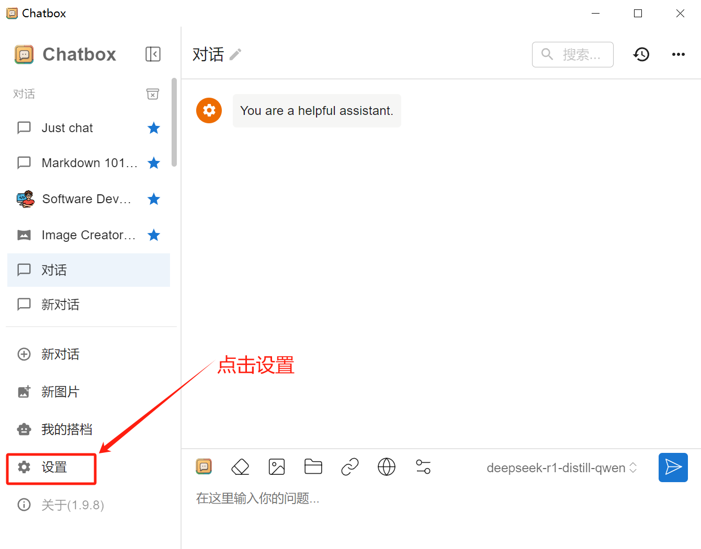

# 在Chatbox中使用 

### 1. Chatbox 是什么？
Chatbox 是一款全平台 AI 聊天客户端，专为大语言模型打造，具备强大的功能，同时安装简便。你可以将它连接到各种大语言模型，并在任何设备（电脑、手机、网页）上随时随地与 AI 互动。

Chatbox 不仅提供流畅、直观的 AI 聊天体验，还具备一系列强大功能：

- ***Artifact 预览***：可直接运行 AI 生成的代码，例如网页、贪吃蛇游戏等，让你即时查看 AI 代码的实际效果。
- ***图表制作***：支持 AI 绘制思维导图、流程图、统计图等各类图表，轻松可视化数据与想法。
- ***文档与图像理解***：可向 AI 发送文档或图片，让 AI 帮助解析、总结或提供相关信息。
- ***网页解析与识别***：可直接发送网页链接，与 AI 讨论网页内容、提取关键信息等。
此外，Chatbox 的安装极为简单，你可以下载适用于不同系统的安装包，或直接使用网页版，无需复杂配置，随时开启智能对话体验。

### 2. 安装使用 Chatbox

Chatbox 的安装极为简单，或直接使用网页版，无需复杂配置，随时开启智能对话体验。

浏览器访问 Chatbox [官网下载安装包](https://chatboxai.app/zh#) 。 

Chatbox 支持所有的主流操作系统，包括 Windows、MacOS 和 Linux，手机系统支持 iOS 和 Android。下载安装包后，在系统中直接安装即可。或者也可以访问和使用 Chatbox 的网页版本。

### 3. 在 Chatbox 中使用 Deepseek-R1 模型

#### 3.1 获取服务地址和API-KEY, 以及需要使用的模型

- 服务地址: https://api.baystoneai.cn/v1
- API-KEY: (登录后在管理台获取)  
- 模型: DeepSeek-R1-Distill-Qwen-14B

#### 3.2 在 Chatbox 中配置

打开 Chatbox，进入设置

创建自定义模型提供方

先点击“模型”切换按钮，在弹出菜单中点击“添加自定义提供方”

配置 Deepseek-R1 模型提供方的接入信息

- 名称: 英智AI
- 服务地址: https://api.baystoneai.cn/v1
- API-KEY: (登录后在管理台获取)
- 模型: DeepSeek-R1-Distill-Qwen-14B

此时，Chatbox已经配置完成，可以使用了。

#### 3.3 在 Chatbox 中使用Deepseek-R1模型

点击 Chatbox 中的“新对话”按钮，在对话框中输入"帮我写一个java 版本的冒泡排序方法" 

点击发送 按钮，等待一会，就可以看到 Deepseek-R1 模型生成的代码了

 通过本章节的内容，已经可以了解如何使用英智AI提供的 Deepseek-R1 模型，并通过 Chatbox 进行交互。Deepseek-R1 模型的出现，为我们带来了前所未有的超智聊天体验，为众多领域的发展提供了强大的支持。