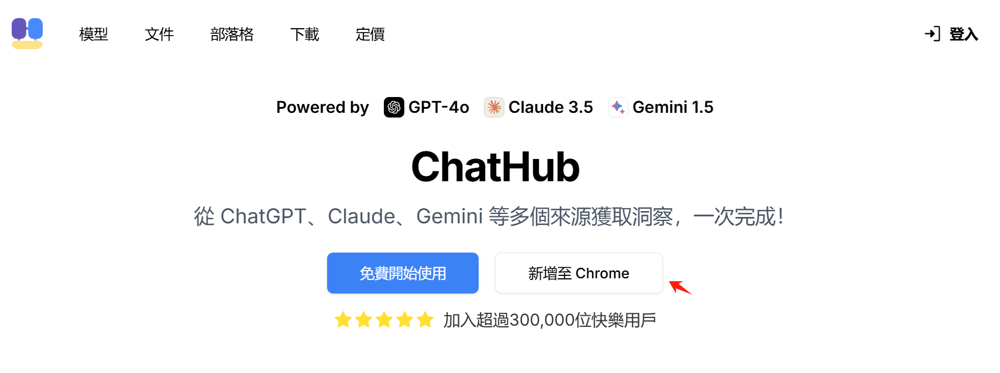
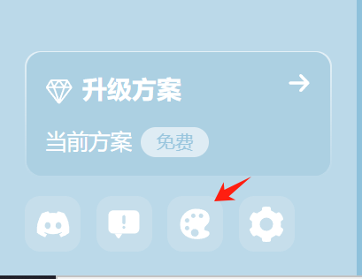
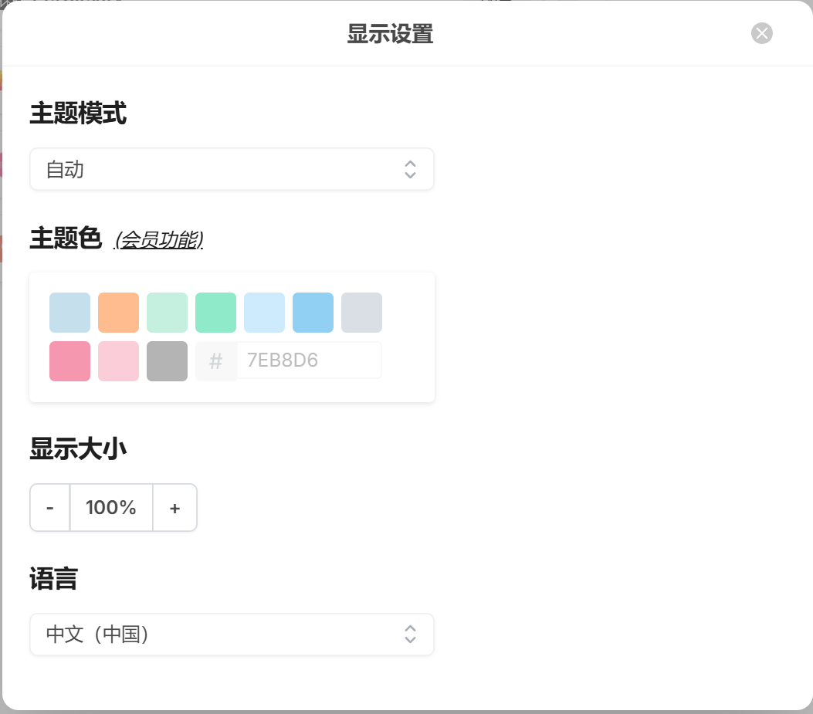
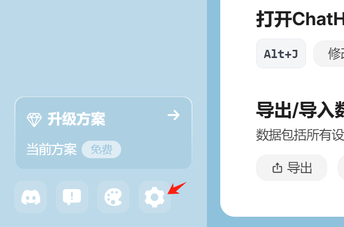
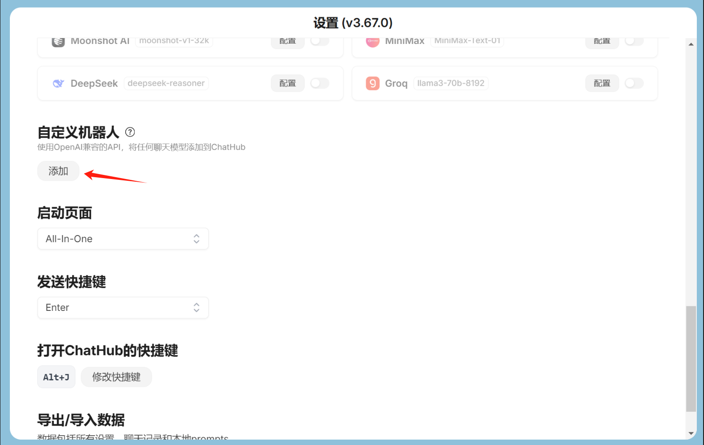
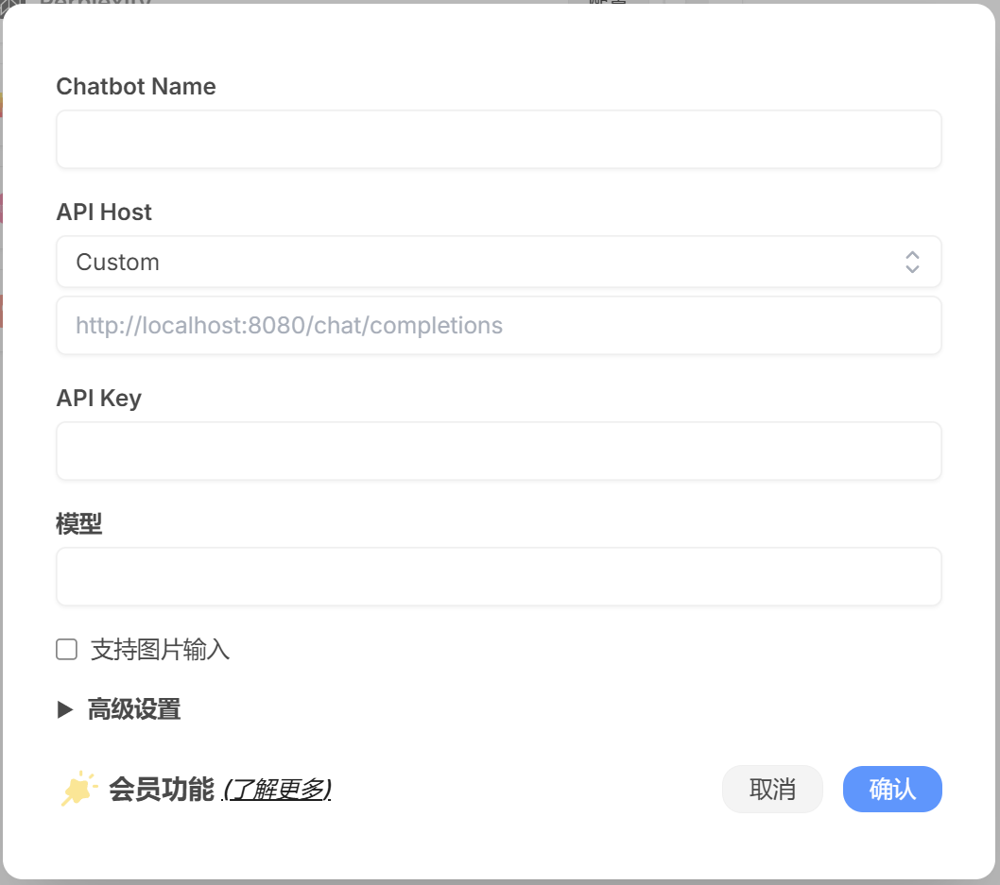
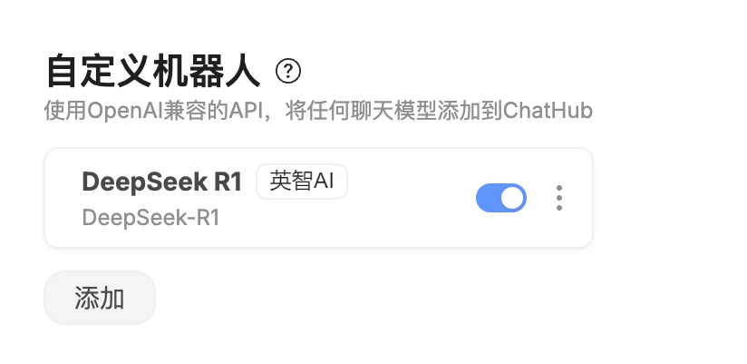
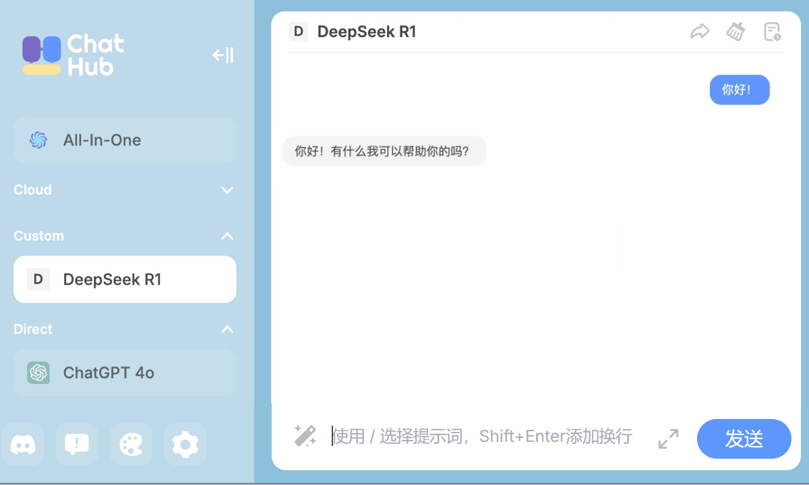

# 在ChatHub中使用 

### 1. 关于 ChatHub

ChatHub 是一款多模型聚合 AI 聊天客户端，支持同时连接多个大语言模型，让用户在一个界面中自由切换和对比不同 AI 的回答。无论是 ChatGPT、Claude、Gemini，还是其他 AI 模型，ChatHub 都能轻松集成，提供高效、灵活的聊天体验。

### 2. 安装 ChatHub

在Chrome浏览器中打开  [ChatHub官网](https://chathub.gg/zh)，点击“新增至Chrome”按钮安装 ChatHub 浏览器插件。

安装后，将自动打开 ChatHub 设置页面.

### 3. 获取配置需要的参数

- 服务地址: https://api.baystoneai.cn/v1
- API-KEY: (登录后在管理台获取)  
- 模型: deepseek-r1-distill-qwen-14b

### 4. 在ChatHub中使用 Deepseek-R1 模型

在Chrome中打开ChatHub,并点击左下角第三个“显示”图标 

在弹出的窗口中,将语言设置成中文.

并点击左下角第四个“设置”图标

在打开的页面中找到“自定义机器人”，点击“添加”按钮

在弹出的窗口中填写以下信息：

点击“确认”后模型即配置成功

### 5. 开始聊天

在ChatHub中选择刚才配置的模型，即可开始聊天。

