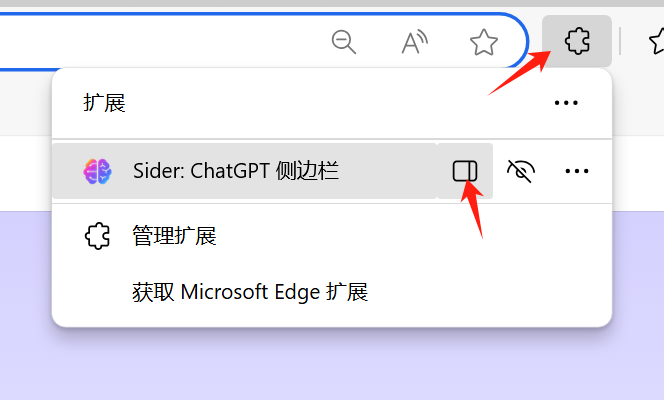
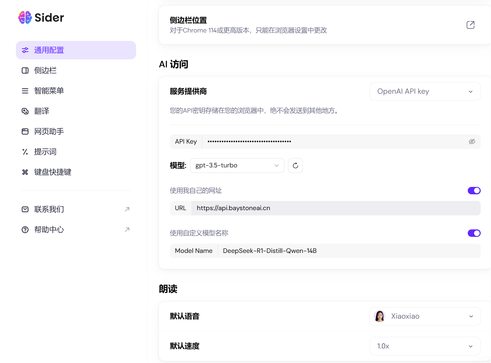

# 在Sider中使用 

### 1. 关于 Sider
Sider 是一个AI聊天和协作平台，旨在帮助团队通过集成的 AI 聊天功能简化工作流程，提供实时的沟通支持。它主要面向开发团队，通过 AI 技术提供自动化的对话接口，来促进开发过程中的信息流动、问题解决和决策制定。

### 2. 安装 Sider 

浏览器打开  
[Sider AI 浏览器插件下载](https://sider.ai/zh-CN/extensions/chatgpt-sidebar-for-chrome-edge-safari)
或者 
[Sider AI 客户端下载](https://sider.ai/download) 

在EDGE浏览器中安装Sider插件

### 3. 获取配置需要的参数

- 服务地址: https://api.baystoneai.cn/ (注意这里没有v1)
- API-KEY: (登录后在管理台获取)  
- 模型: deepseek-r1-distill-qwen-14b

### 4. 配置 Sider 

打开Sider侧边栏

点击测边栏的 设置图标

在设置页面输入参数 如下图

到这里就配置完成了. 

### 5. 发起对话

在侧边栏输入"讲一个龟兔赛跑的故事,至少500字" 然后点击发送

