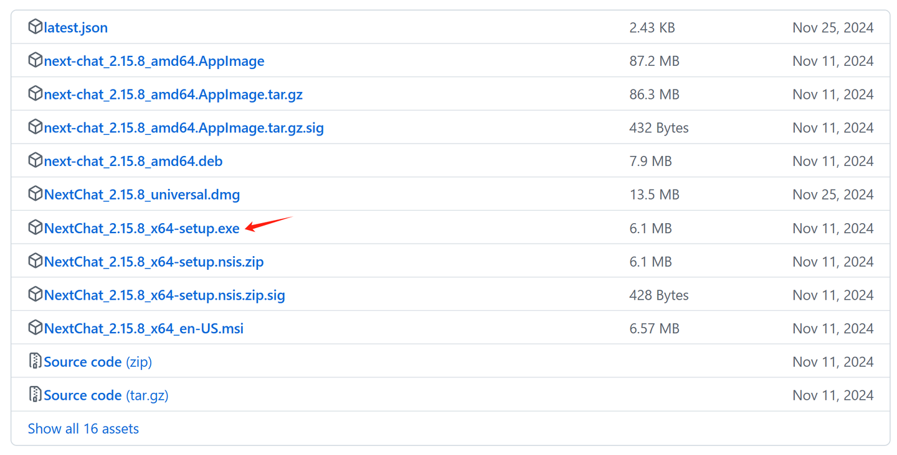
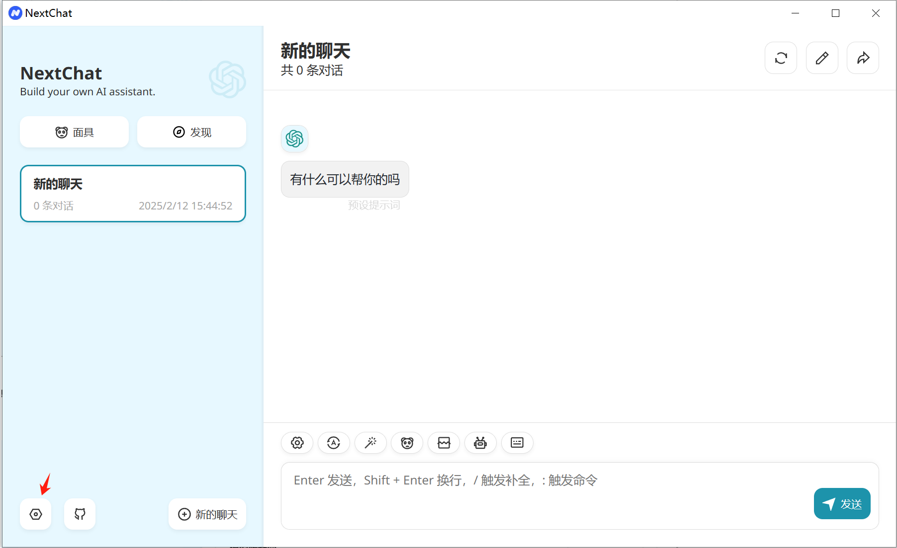
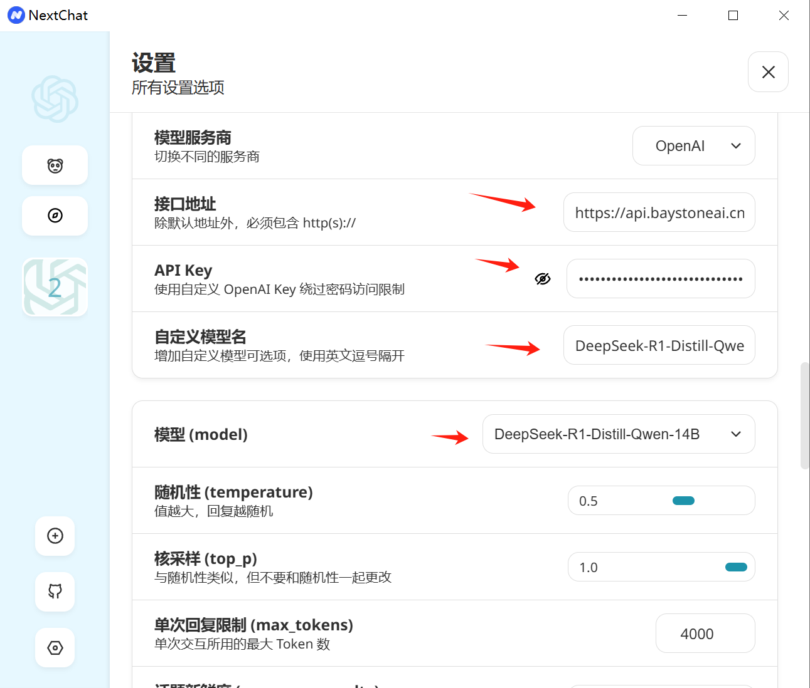
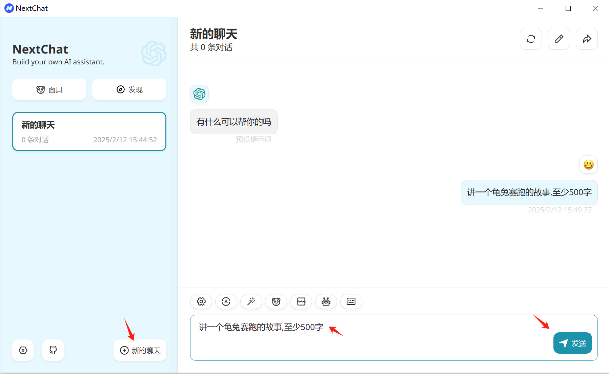
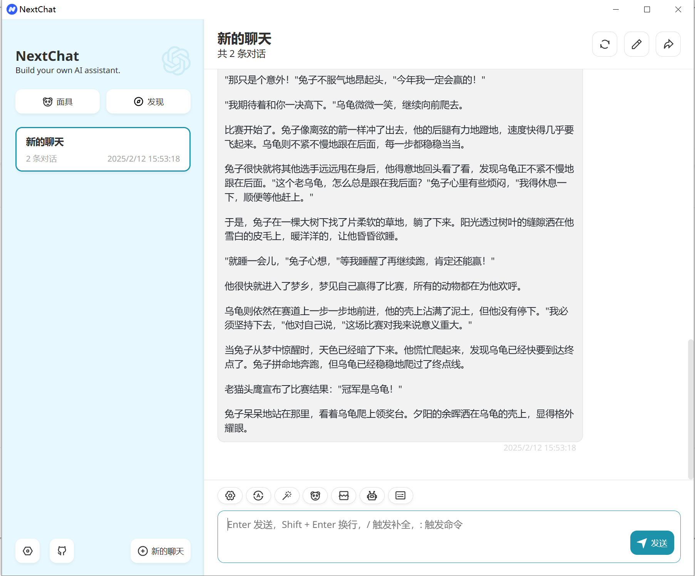

# 在NextChat中使用 

### 1. 关于NextChat
NextChat 是一个基于人工智能的对话平台，通常用于提供聊天机器人或自动化客户支持服务。它是一些公司和开发者用来增强用户交互体验的工具，允许通过自然语言处理（NLP）与用户进行实时对话。这个平台常见于网站、应用程序、在线商店等各种场景中，以自动化处理用户问题、提供服务、解答疑问或完成任务。

### 2. 下载并安装NextChat

- 1.打开浏览器，访问 [NextChat](https://github.com/ChatGPTNextWeb/NextChat/releases)。
- 2.选择适合你操作系统的版本进行下载。
- 3.下载完成后，按照安装向导完成安装过程。

### 3. 获取配置需要的参数

- 服务地址: https://api.baystoneai.cn (注意这里没有v1)
- API-KEY: (登录后在管理台获取)  
- 模型: deepseek-r1-distill-qwen-14b

### 4. 配置NextChat

打开NextChat  点击配置图标

输入配置模型所需要的参数

到这里NextChat已经配置完成

### 5. 使用NextChat

打开NextChat 点击 "新的聊天"  并在输入框中输入 "讲一个龟兔赛跑的故事,至少500字"

点击发送按钮  nextchat 输出了精彩的故事文本

