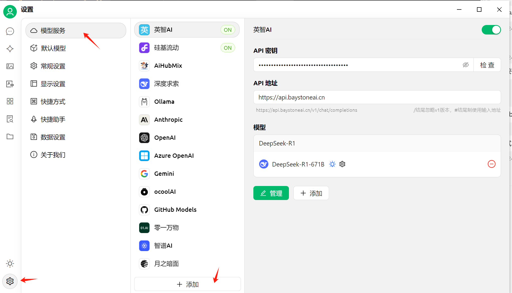
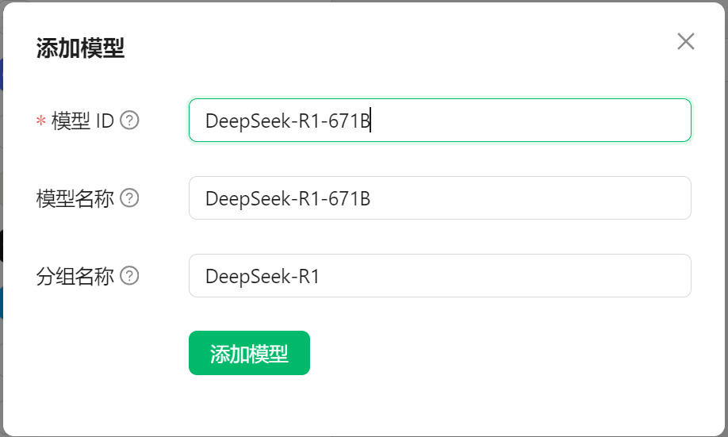

# 在Cherry Studio中使用


### 1. 安装 Cherry Studio

Cherry Studio 是一款支持多模型服务的桌面客户端，内置了各种分类的千余助手，旨在帮助用户在多种场景下提升工作效率。支持Win、macOS、Linux平台，无需复杂设置即可使用。
Cherry Studio 内置众多服务商，同时也支持其他兼容OpenAI/Anthropic等API格式的服务商，以及支持本地模型运行。
Cherry Studio 提供了诸如完整的 Markdown 渲染、智能体创建、翻译功能、文件上传和多模态对话等个性化功能，并具有友好的界面设计和灵活的主题选项，旨在为用户提供全面而高效的 AI 交互体验。


#### 1.1 下载 Cherry Studio

- [官网下载](https://cherry-ai.com/)
- [开源下载](https://github.com/CherryHQ/cherry-studio/releases/latest)


#### 1.2 安装教程

- [Windows 安装](https://docs.cherry-ai.com/pre-basic/installation/windows)
- [macOS 安装](https://docs.cherry-ai.com/pre-basic/installation/macos)


### 2. 配置【英智未来】的模型服务

#### 2.1 新建【英智未来】模型服务的API密钥

> 如果在【英智大模型推理API】平台已经创建过API密钥，可跳过此步。

1. 在【英智大模型推理API】平台，进入【我的控制台】

   


3. 新建API密钥

   


5. API密钥的操作

   


> 以下操作在Cherry Studio中执行。

#### 2.2 添加【英智未来】模型服务


#### 2.3 设置【英智未来】模型服务访问信息



```python
# 填写说明
  API密钥：2.1中创建的密钥
  API地址：https://api.baystoneai.cn
```

#### 2.4 添加模型




```python
# 填写说明
  模型ID：从2.1的【英智大模型推理API】平台支持的大模型列表中选择，复制列表【模型】列的模型名称
```


### 3. 模型服务使用

使用语言模型服务聊天

1. 点击左侧菜单栏的【助手】按钮

   

2. 点击顶部菜单中的模型名称，选择【英智未来】的模型服务

   

3. 在输入框内输入文字即可开始聊天

   

