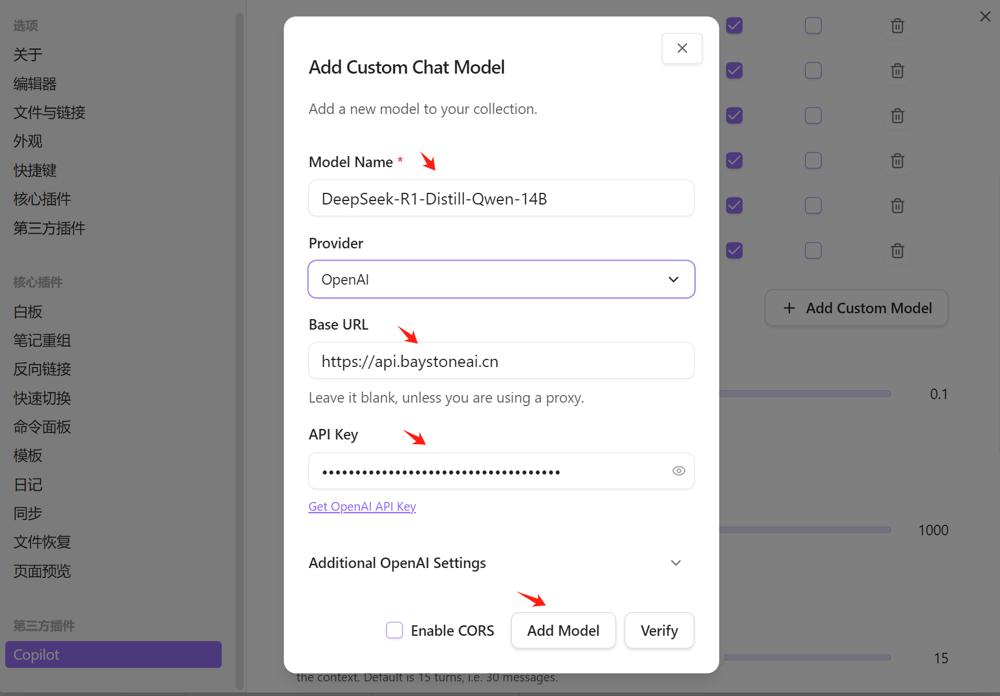

# 在Obsidian Copilot中使用 

### 1. 关于Obsidian Copilot

Obsidian Copilot 是一个基于 AI 的工具，旨在帮助用户更高效地使用 Obsidian。它可以自动生成笔记、提示和其他内容，从而节省用户的时间和精力。

### 2. 下载并安装 Obsidian

在浏览器中打开 [Obsidian 官网](https://obsidian.md/)  ，点击“Get Obsidian for Windows”按钮，选择适合你操作系统的版本进行下载。

下载完成后，按照安装向导完成安装过程。

### 3. 在 Obsidian 中 安装插件 Copilot

安装Copilot插件的步骤如下：
1. 打开 Obsidian，点击左侧的“设置”按钮，关闭安全模式。

2. 在“社区插件”页面中，点击“浏览”按钮，然后在搜索框中输入“Copilot”。

3. 点击在搜索结果中找到“Copilot”插件，进入插件详情页面, 点击 “安装”按钮, 安装插件。

4. 安装完成后，点击“启用”按钮。

### 4. 获取配置需要的参数

- 服务地址: https://apiemp.baystoneai.com/cognihub/service 
- API-KEY: (登录后在管理台获取)  
- 模型: deepseek-r1-distill-qwen

### 5. 在Obsidian Copilot中配置模型

点击左侧的“设置”按钮，

在弹出的页面中点击 "第三方插件"下面的 "Copilot"  选择"MODEL"选项卡

点击 "Add Custom Model" 按钮

在弹出的页面中输入模型的各个参数

点击 "Add Model" 按钮，完成模型的配置。

### 6. 使用 Deepseek-R1 模型

在 Obsidian 中打开一个笔记，点击左侧的“Copilot”按钮，选择“Deepseek-R1”模型，点击“生成”按钮，即可生成内容。

							