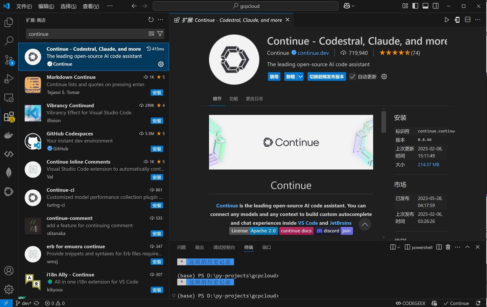
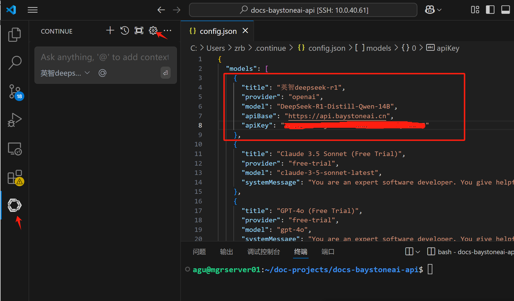
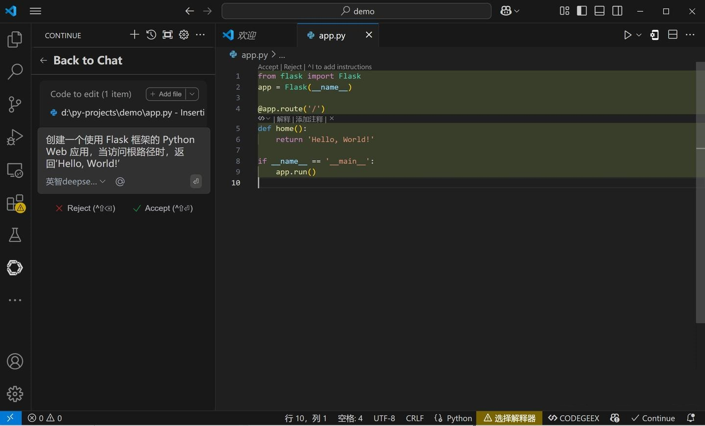

# 在VSCode CONTINUE中使用 

### 1.关于VSCode 
Visual Studio Code（简称 VS Code）是由微软开发的一款免费、开源、跨平台的代码编辑器。 
它支持多种操作系统，包括 Windows、macOS 和 Linux。VS Code 提供了丰富的功能，如语法高亮、智能代码补全（IntelliSense）、代码重构、内置调试器以及 Git 版本控制集成。此外，用户可以通过安装各种扩展来增强编辑器的功能，以适应不同的开发需求。


### 2.关于CONTINUE

Continue 是一款开源的 AI 代码助手插件，适用于 Visual Studio Code（VS Code）和 JetBrains 等集成开发环境（IDE）。 
MARKETPLACE.VISUALSTUDIO.COM
它提供了智能聊天、代码自动补全和代码编辑等功能，旨在提升开发者的编程效率。


### 3.获取模型服务的相关参数

- 服务地址: https://api.baystoneai.cn/v1
- API-KEY: (登录后在管理台获取)  
- 模型: deepseek-r1-distill-qwen-14b

### 4.在VSCode 中 安装 CONTINUE

在扩展中 搜索 CONTINUE 并安装CONTINUE. 


### 5.配置 CONTINUE

安装完成后，点击 CONTINUE 图标，然后点击设置图标，进行配置。

- 服务地址: https://api.baystoneai.cn/v1
- API-KEY: (登录后在管理台获取)
- 模型: deepseek-r1-distill-qwen-14b

```json
    {
      "title": "英智deepseek-r1",
      "provider": "openai",
      "model": "deepseek-r1-distill-qwen-14b",
      "apiBase": "https://api.baystoneai.cn/v1",
      "apiKey": "*********8"
    },
```

### 6.使用 CONTINUE

配置完成后，就可以使用CONTINUE了。 点击 CONTINUE 图标，然后点击聊天图标，就可以开始聊天了。

- 1.打开 VSCode，新建一个 Python 文件，命名为app.py。
- 2.CONTINUE中输入"创建一个使用 Flask 框架的 Python Web 应用，当访问根路径时，返回‘Hello, World!’"，然后点击“发送。
- 3.稍等片刻，CONTINUE 就会利用 DeepSeek-R1-API 为我们生成代码。


