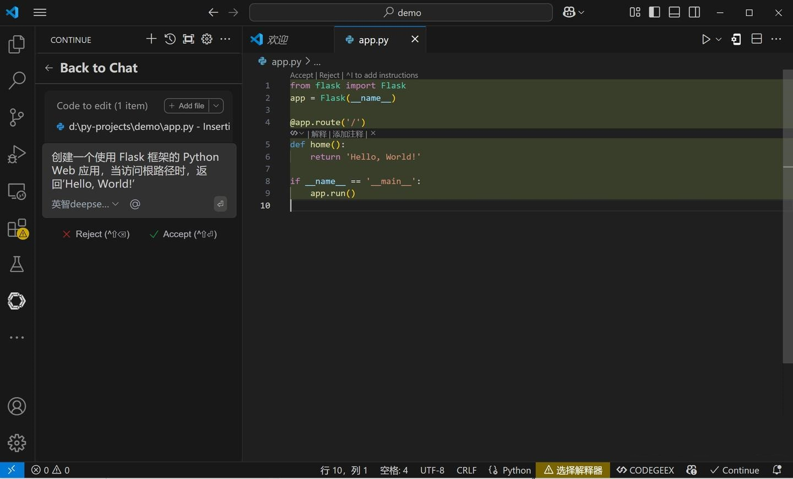

# 在VSCode 的插件Cline中使用 

### 1.关于VSCode 
Visual Studio Code（简称 VS Code）是由微软开发的一款免费、开源、跨平台的代码编辑器。 
它支持多种操作系统，包括 Windows、macOS 和 Linux。VS Code 提供了丰富的功能，如语法高亮、智能代码补全（IntelliSense）、代码重构、内置调试器以及 Git 版本控制集成。此外，用户可以通过安装各种扩展来增强编辑器的功能，以适应不同的开发需求。

### 2.关于Cline

Cline 是 Visual Studio Code（VSCode）中的一款强大插件，旨在为开发者提供智能化的编程辅助。通过集成先进的人工智能模型，如 DeepSeek-V3 和 Claude 3.5 Sonnet，Cline 能够在代码补全、错误检测、代码生成等方面大幅提升开发效率。

### 3.获取模型服务的相关参数

- 服务地址: https://api.baystoneai.cn/v1
- API-KEY: (登录后在管理台获取)  
- 模型: deepseek-r1-distill-qwen-14b

### 4.在VSCode 中 安装 Cline

在扩展中 搜索 Cline 并安装Cline. 

### 5.配置 Cline

安装完成后，点击 Cline 图标，然后点击设置图标，进行配置。

- 服务地址: https://api.baystoneai.cn/v1
- API-KEY: (登录后在管理台获取)
- 模型: deepseek-r1-distill-qwen-14b

### 6.使用 Cline

配置完成后，就可以使用Cline了。 点击 Cline 图标，然后点击聊天图标，就可以开始聊天了。

- 1.打开 VSCode，新建一个 Python 文件，命名为app.py。
- 2.Cline中输入"创建一个使用 Flask 框架的 Python Web 应用，当访问根路径时，返回‘Hello, World!’"，然后点击“发送。
- 3.稍等片刻，Cline 就会利用 DeepSeek-R1-API 为我们生成代码。

