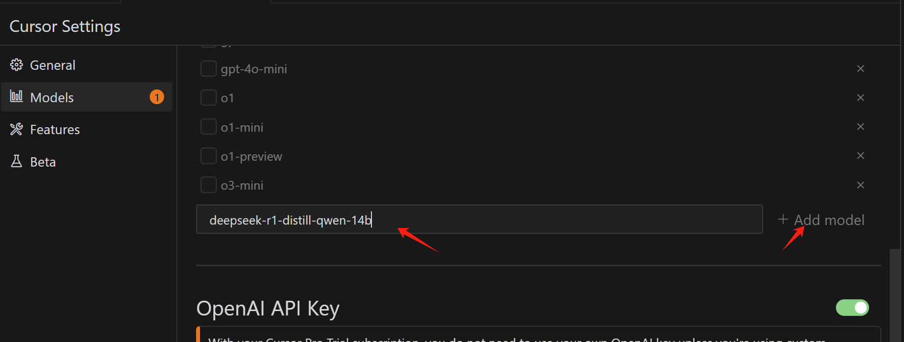
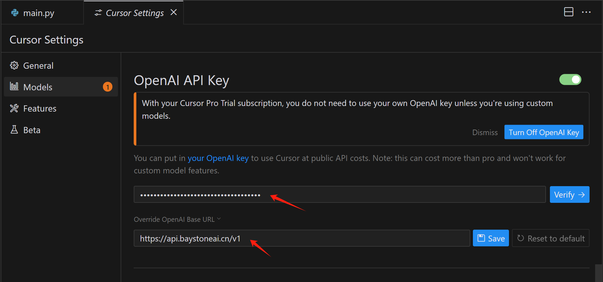
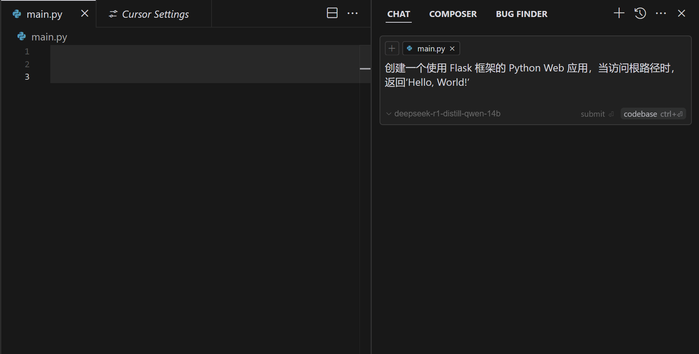
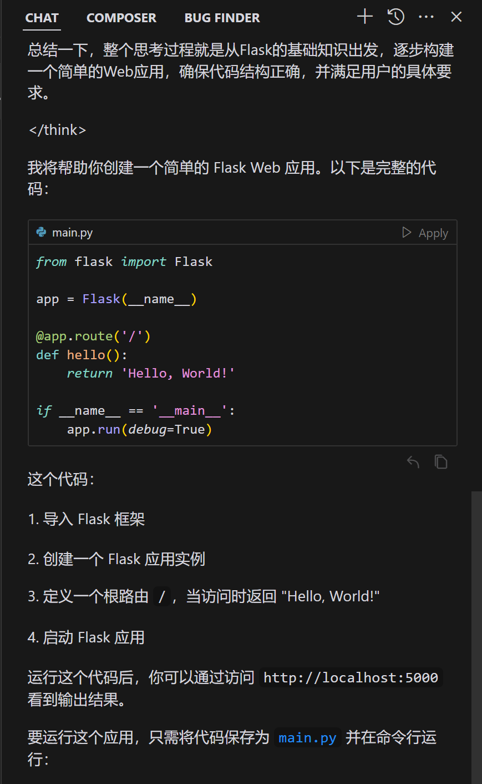
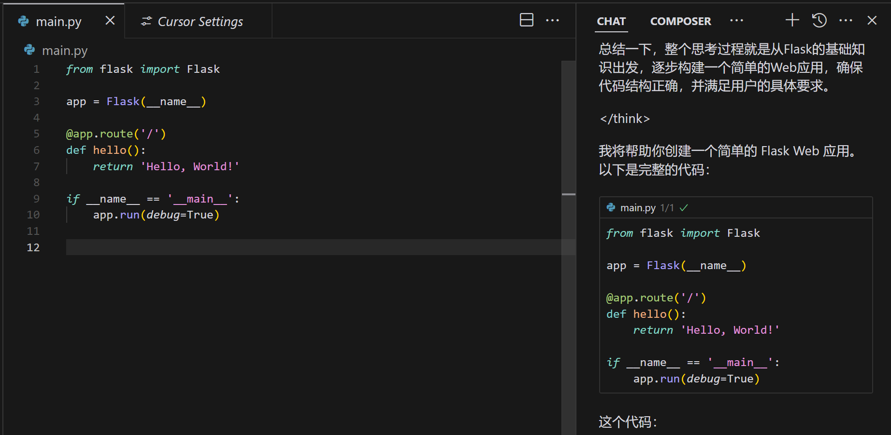

# 在Cursor中使用 

### 1.关于Cursor
Cursor 是一个为开发者提供快速、智能、高效编程体验的 IDE，尤其适合 AI 助力编程、快速原型开发以及团队协作的场景。它结合了现代云技术和人工智能，旨在减少开发者的重复劳动并提高工作效率。

### 2.下载并安装
你可以从 [Cursor 官网](https://www.cursor.com/cn) 下载并安装 Cursor。安装完成后，你可以按照官方的指南进行配置和使用。

### 3.获取模型服务的相关参数

- 服务地址: https://api.baystoneai.cn/v1
- API-KEY: (登录后在管理台获取)  
- 模型: deepseek-r1-distill-qwen-14b

### 4.配置Cursor接入DeepSeek-R1模型

1. 打开Cursor，点击右上角的设置按钮，选择“模型”选项卡。
2. 在“Models”选项卡中，点击“Add model”按钮。 输入"deepseek-r1-distill-qwen-14b" 再次点击“Add model”按钮,将模型添加到Cursor中。

3. 在OpenAI API KEY中输入你的API-KEY 和  Override OpenAI Base URL 中输入服务地址:https://api.baystoneai.cn/v1

4. 点击“Verify”按钮, 验证配置，完成配置。

### 5.使用DeepSeek-R1模型

配置完成后，你可以在Cursor中选择DeepSeek-R1模型，开始使用了。

1. 在Cursor中 打开一个空的文件夹, 作为项目的文件的目录. 

2. 创建一个main.py文件，并在文件中输入 快捷方式 Ctrl+L。这个时候会打开聊天对话窗口 选择模型"deepseek-r1-distill-qwen-14b"

3. 在对话窗口中 输入"创建一个使用 Flask 框架的 Python Web 应用，当访问根路径时，返回‘Hello, World!’"

4. 点击“提交”按钮，生成代码。

5. 点击代码后面的 Apply 按钮，将代码应用到文件中。

### 6.注意事项   

1. 请确保你已经在模型服务平台上注册并获取了API-KEY。  
2. 请确保你已经在Cursor中配置了DeepSeek-R1模型。  
3. 请确保你已经在Cursor中选择了DeepSeek-R1模型。  
4. 请确保你已经在Cursor中输入需要生成代码的要求。  

