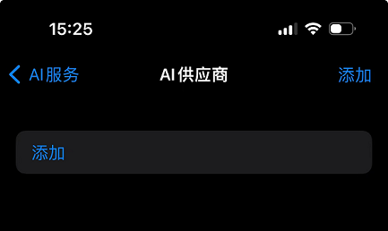
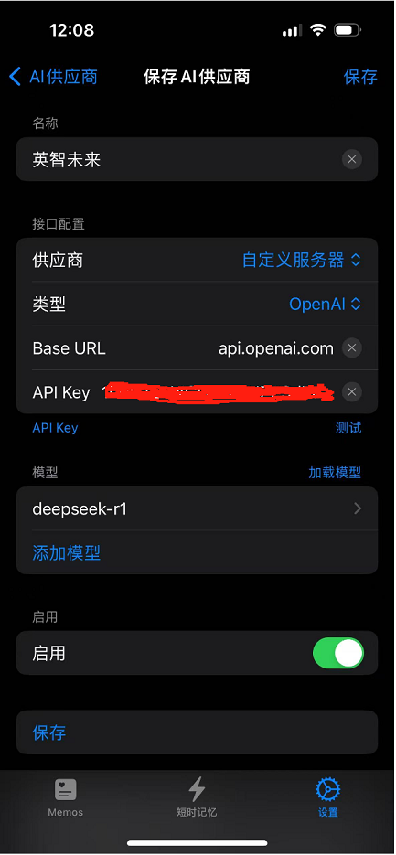
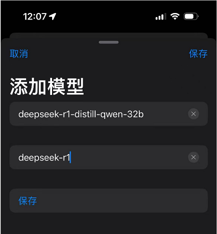
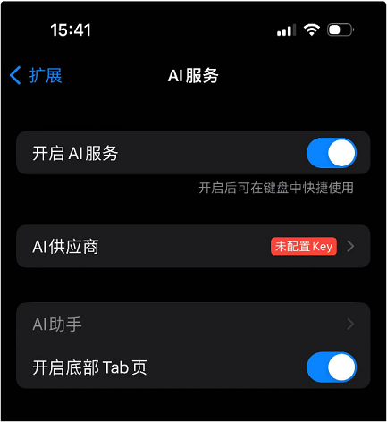
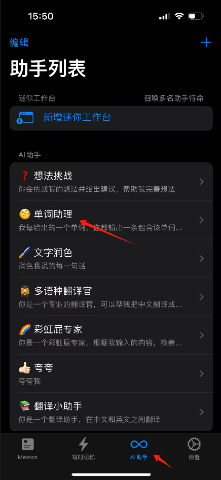
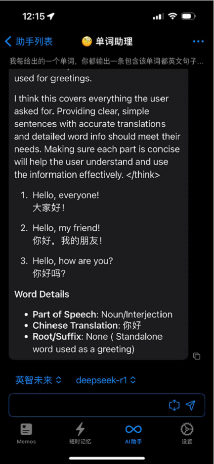
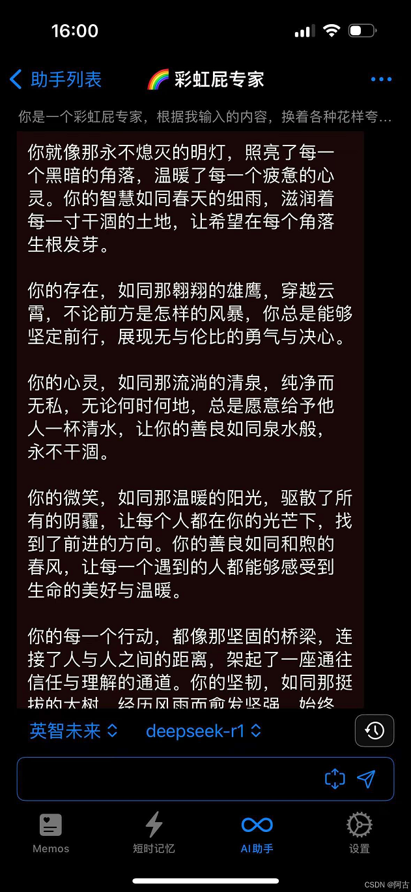

# 在ToMemo中使用 

### 1.关于ToMemo

ToMemo 是一款专为苹果设备打造的效率类应用，能让你轻松管理常用短语与剪贴板内容，提供智能分词、快捷输入、动作库等实用功能，还支持接入 AI 助手，搭配自定规则、个性化定制与多平台兼容，全方位助力你高效处理文本，提升日常操作效率 。

### 2.下载并安装

- 打开App Store 搜索 ToMemo 并下载安装  如果您已经安装了ToMemo，请忽略此步骤。

### 3.获取模型服务的相关参数

  进入[官网](https://api.baystoneai.com) 注册登录并获取以下参数备用

- 服务地址: https://api.baystoneai.cn
- API-KEY: [打开获取API-KEY](https://api.baystoneai.com/manager/apiKey)
- 模型: deepseek-r1-distill-qwen-32b

### 4.配置ToMemo的AI服务

1) 添加AI供应商

在手机上打开ToMemo，下方主菜单中打开"设置"->选择"扩展"->选择"AI服务"->选择"AI供应商" 点击右上角的"添加"按钮

输入以下信息:

- 供应商: 选择自定义服务器
- 类型: OpenAI
- Base URL: https://api.baystoneai.cn
- API-KEY: 输入获取到的API-KEY
- 名称: 英智未来

添加模型 :deepseek-r1-distill-qwen-32b

2) 添加AI助手到主菜单

在手机上打开ToMemo，下方主菜单中打开"设置"->选择"扩展"->选择"AI服务" 开启底部Tab页

### 5.使用DeepSeek-R1模型

配置完成后，你可以在ToMemo中选择DeepSeek-R1模型，开始使用了。

在底部的"AI助手" --> 点击 "单词助理"

在"单词助理"中，你可以输入你想要查询的单词，AI助手会自动生成单词的释义和例句。比如 输入 "hello"，AI助手会自动生成单词的释义和例句。

同样也可以在"彩虹屁专家"中这么使用

